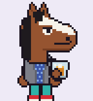

# BoJack Horseman: a Hermes Agent pet



This is a fan-made pixel-art BoJack pet for [Hermes Agent](https://github.com/NousResearch/hermes-agent).
It uses the petdex/Codex atlas format: 1536×1872, 8 columns × 9 rows of 192×208 frames.

| Row | State | What BoJack does |
| --- | --- | --- |
| 0 | idle | Nurses a whiskey on the rocks, sips, smirks |
| 1 | running-right | Runs right |
| 2 | running-left | Runs left |
| 3 | waving | Waves (turn finished) |
| 4 | jumping | Hops with a heart (plan done) |
| 5 | failed | Slumps and cries under a rain cloud |
| 6 | waiting | Arms crossed, taps his foot, `...` bubble |
| 7 | running | Jogs and kicks up dust (tool running) |
| 8 | review | Reads a script (model thinking) |

## Install

**Windows (PowerShell):**

```powershell
irm https://raw.githubusercontent.com/sounith1/AI-For-Beginners/claude/bold-ptolemy-25s8bp/etc/hermes-pets/bojack/install.ps1 | iex
hermes pets show --cycle
```

The script installs into `$env:HERMES_HOME\pets\bojack`, or `%LOCALAPPDATA%\hermes\pets\bojack` if `HERMES_HOME` isn't set, and then selects the pet.

**macOS / Linux (run from this folder):**

```bash
mkdir -p ~/.hermes/pets/bojack        # or $HERMES_HOME/pets/bojack for a custom profile
cp pet.json spritesheet.webp ~/.hermes/pets/bojack/
hermes pets select bojack
hermes pets show --cycle              # preview every state
```

## Edit

The sprite is drawn in code. To change it, edit `make_bojack.py` (it has the palette, poses and props) and then run:

```bash
pip install pillow
python make_bojack.py   # rewrites spritesheet.webp, pet.json, preview.gif
```

BoJack Horseman is © Netflix / Tornante. This is non-commercial fan art for personal use.
