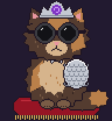

# Princess Donut: a Hermes Agent pet



This is a fan-made pixel-art Princess Donut from *Dungeon Crawler Carl*, with Mongo, for [Hermes Agent](https://github.com/NousResearch/hermes-agent).
She has her tiara, round sunglasses, butterfly pendant and scale-mail pauldron. The sheet uses the petdex/Codex atlas format: 1536×1872, 8 columns × 9 rows of 192×208 frames.

| Row | State | What Donut does |
| --- | --- | --- |
| 0 | idle | Sits on her red velvet cushion, swishes her tail, tiara sparkles |
| 1 | running-right | Rides Mongo |
| 2 | running-left | Rides Mongo |
| 3 | waving | Waves a paw (turn finished) |
| 4 | jumping | Mongo leaps while Donut cheers (plan done) |
| 5 | failed | Sunglasses fall off, sad eyes, storm cloud |
| 6 | waiting | Tail flicks impatiently, `...` bubble |
| 7 | running | **Magic missiles from her eyes** (tool running) |
| 8 | review | Reads a spellbook (model thinking) |

## Install

**Windows (PowerShell):**

```powershell
irm https://raw.githubusercontent.com/sounith1/AI-For-Beginners/claude/bold-ptolemy-25s8bp/etc/hermes-pets/princess-donut/install.ps1 | iex
hermes pets show --cycle
```

**macOS / Linux (run from this folder):**

```bash
mkdir -p ~/.hermes/pets/princess-donut
cp pet.json spritesheet.webp ~/.hermes/pets/princess-donut/
hermes pets select princess-donut
```

## Edit

The sprite is drawn in code. To change it, edit `make_donut.py` (it has the palette, poses and props) and then run `python make_donut.py`.
Mongo's colors are the `RAPTOR*` constants.

Princess Donut and Mongo are from *Dungeon Crawler Carl* by Matt Dinniman. This is non-commercial fan art for personal use.
